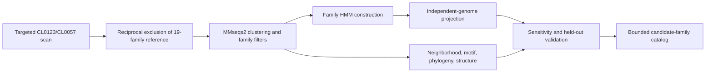

# Analysis workflow

```mermaid
flowchart LR
  A[Targeted CL0123/CL0057 scan] --> B[Reciprocal exclusion of 19-family reference]
  B --> C[MMseqs2 clustering and family filters]
  C --> D[Family HMM construction]
  D --> E[Independent-genome projection]
  C --> F[Neighborhood, motif, phylogeny, structure]
  E --> G[Sensitivity and held-out validation]
  F --> G
  G --> H[Bounded candidate-family catalog]
```

The workflow terminates in a computational catalog, not an experimentally confirmed regulome. Figure S10 provides a submission-ready raster version.
